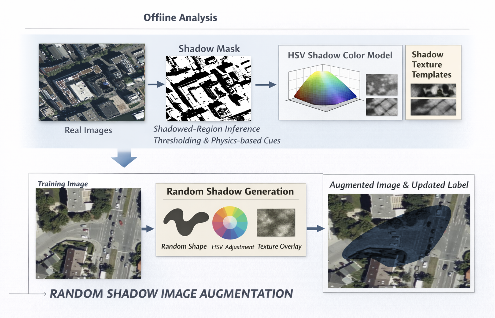

# Random Shadow Augmentation for Robust Road-Marking Detection in Overhead Imagery

Shadows in overhead imagery substantially degrade road-marking detection, causing false negatives in occluded regions. This repository introduces **Random Shadow Augmentation**, a plug-in data augmentation method that rebalances shadowed feature exposure during training by applying randomized yet realistic shadow effects to input images.

The pipeline consists of:
- (i) shadow-region segmentation;
- (ii) shadow color parameterization in HSV space;
- (iii) texture template construction from real shadow regions;
- (iv) random shadow shape synthesis using Bézier curves; and
- (v) randomized shadow generation and compositing.

On stopline and crosswalk detections, the method reduces false negatives by over 20% and improves F1 by 1–2 percentage points on the primary evaluation; broader experiments across datasets and road-marking types show consistent gains of up to 2–5 percentage points — without model re-architecture or custom loss functions.

The scripts for shadow augmentation are readily to be integrated to [Detectron2](https://github.com/facebookresearch/detectron2) framework to support Satellite/Aerial imagery dataset based road marking detections.
